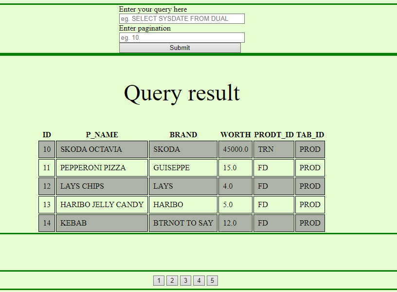
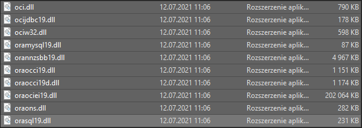
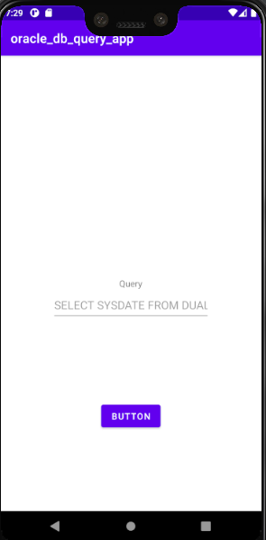
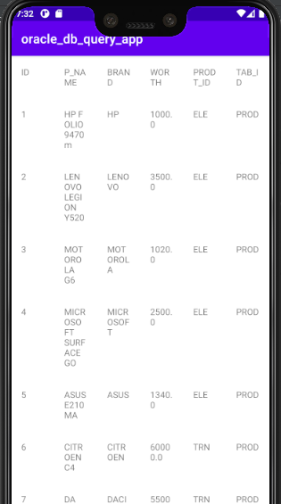

## ORACLE DB FOR ANDROID

Simple android app that is able to get data from oracle db
API has also a frontend done so you can query your oracle db from web app 
instead of android app



# HOW TO SET UP API
```commandline
python -m venv flask_api
flask_api\\Scripts\\activate.bat
pip install -r requirements.txt
```
you might need to change dao.conn values in order to use your own user.

# RUN API
```commandline
python main.py
```

## CONFIGURE PYTHON TO BE ABLE TO CONNECT TO ORACLE DB
<a href=https://www.oracle.com/database/technologies/instant-client/downloads.html>Download</a> Oracle Instant Client 

paste this files into directory that you have your python installed


# Android app showcase
"select sysdate from dual" is only a place holder 
 

# WHAT'S MORE
I also included some pl sql code like abc analisis
or package that can help you create indexes when needed.